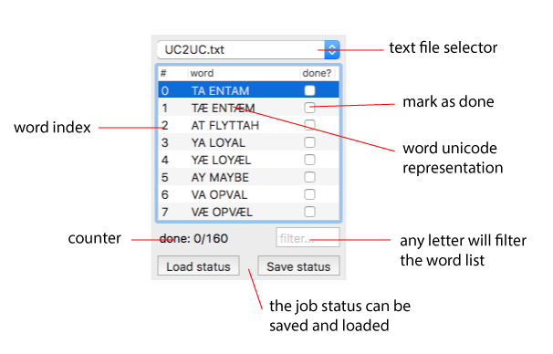
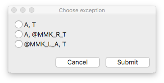
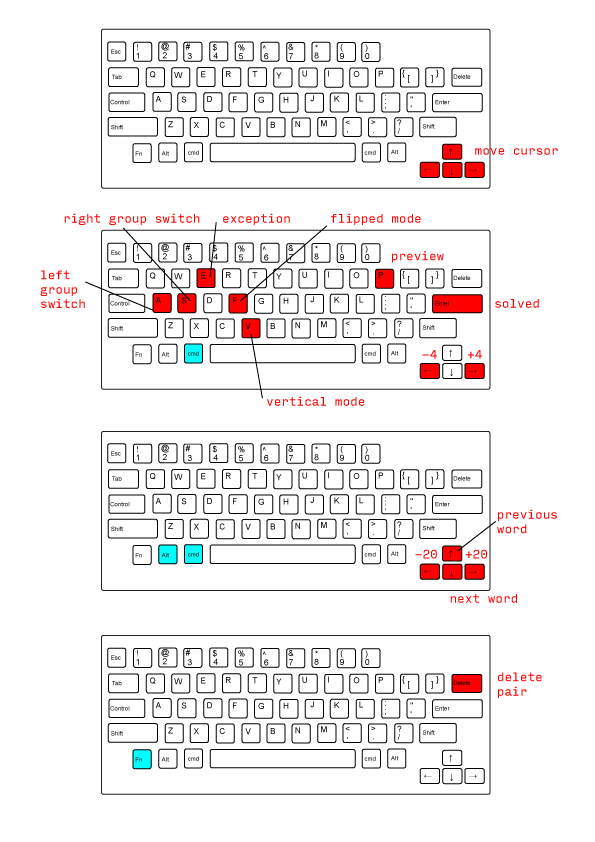

# Index
1. Editor components
	1. the kerning view and its display options
	1. texts manager
	1. fonts order manager
	1. joystick
1. Browse through pair and words
	1. navigate the view
	1. navigate through the word list
	1. navigate through the text dictionaries
	1. filter words
1. Make corrections
	1. using keyboard
	1. typing exact value
	1. symmetrical
	1. flipped
	1. vertically
	1. mark correction as done
1. Make exceptions
	1. browse through groups
	1. trigger exception
	1. delete exception
1. Undo and redo philosophy
1. Save and load kerning status
1. Shortcuts map

## 1. Editor components
1. **The kerning view and its display options**. This view displays the sequence of glyph provided by the texts in each opened font. Its appereance is controlled by the display option checkboxes in the lower left corner of the user interface

	

	Let’s look in detail to what is displayed for each pair

	

1. **Texts manager**. This component handles the text data stored into the application. It is possible to swap between different lists, mark some words as done, filter the list according to letters combination and manage the status of the job (save and load). Each word is accompained by an index which can be used to refer easily to it.

	

1. **Fonts order manager**. This component handles the order of the fonts into the kerning view. Each opened font – if saved on the computer – is displayed in the view and its name in this component. Arrows are provided in order to change the order.

1. **The joystick**. This component contains buttons mostly related to data manipulation (display options are stored separately). These buttons are linked to a shortcut, keyboard is usually a faster way than mouse to kern pairs. The shortcuts are listed at the end of the documentation.

	

## 2. Browse through pair and words

1. **Navigate the view**. You can navigate the view using the cursors from the joystick or the text manager. Up and down arrows move the cursor vertically across the displayed fonts, left and right arrows move the cursor horizontally across the displayed pairs.

	<video src="videos/moveCursor.mp4" controls width="840" type="video/mp4">

2. **Navigate through the word list**. Previous word (north west arrow button) and next word (south east arrow button) switch the kerning view to a different word. It is possible to double click on an element of the texts manager list and switch to a different word. If a word is marked as solved using the “solved” button, the kerning view switches automatically to the next word in the list. 

	<video src="videos/changeWord.mp4" controls width="840" type="video/mp4">

	It is possible to jump to a specific line into the list using the cmd+j shortcut.
	A floating window will appear, just type in the index of the line you are looking for and hit the Ok button.

	

1. **Navigate through the texts**. The kerning editor has text data store in itself. Different texts, organized for different kinds of kerning are accessible through the texts manager component. The pop up button on the top of the texts manager components allows the user to browse and switch between them.

1. **Filter words**. The texts manager component allows to filter temporarily the word list in order to find patterns across words. If you type any letter into the filter editor, the list will be filtered immediately.

	<video src="videos/filterWords.mp4" controls width="840" type="video/mp4">

## 3. Make corrections
1. **Using keyboard**. It is possible to change the kerning value for a pair using the keyboard. Using the arrows you can place the cursor below the pair you would like to correct, and then using the combination cmd+leftArrow or cmd+rightArrow you can create a new kerning pair or change the value of an existing pair using the small step (+4 or -4). If you add alt the combination you can use the big step (+20 or -20).

	<video src="videos/makeCorrections.mp4" controls width="840" type="video/mp4">

1. **Typing exact value**. It is possible to type the exact value of a correction into the edit component placed in the joystick near the arrows. It accepts positive and negative interger values.

	<video src="videos/typeValue.mp4" controls width="840" type="video/mp4">

1. **Symmetrical editing**. Kerning pairs like \\ and // often need to have the same kerning correction. They are not the same glyphs in a flipped order, they are different but symmetrical. There are two different kinds of symmetrical glyphs: pure symmetrical or symmetrical couples.

	<video src="videos/symmetrical.mp4" controls width="840" type="video/mp4">

	Here the list the purely symmetrical glyphs:
	A, H, I, O, T, U, V, W, X, Y, period, colon, semicolon, ellipsis, underscore, hyphen, endash, emdash, bullet, periodcentered, exclam, exclamdown, bar, brokenbar, dagger, daggerdbl, quotesingle, quotedbl, asterisk, degree

	Here the list of the symmetrical couples:
	* guilsinglleft, guilsinglright
	* guillemotleft, guillemotright
	* parenleft, parenright
	* bracketleft, bracketright
	* braceleft, braceright
	* slash, backslash

	For example, if symmetrical mode is activated:

	* A\ is corrected as /A
	* _A is corrected as A_
	* // is corrected as \\
	* (/ is corrected as \)

1. **Flipped editing**. Kerning pairs like TA and AT often need to have the same kerning correction. In this case it is possible to activate the flipped editing mode on, and while correcting any pair, its flipped version will receive the same correction.

	<video src="videos/flipped.mp4" controls width="840" type="video/mp4">

1. **Vertically aligned editing**. It is possible to correct the same pair across different fonts at once. Activating the vertically editing mode, a cursor will appear below each word set in each font. Only the horizontal axis will still be free, and the pairs across the fonts will be manipulated at once.

	<video src="videos/vertical.mp4" controls width="840" type="video/mp4">

1. **Mark correction as done**. While kerning, it is possible to mark a word as done (or undone) in two ways:

	* using cmd+return combination (in this case the next word will be immediately displayed)
	* clicking the checkbox into the texts manager list

## 4. Make exceptions
1. **browse through groups**. If a glyph from the pair selected by the cursor is part of any class, it is possible to switch the foreground glyph (the one drawn in solid black) with another glyph from the class. As soon as the cursor is moved to another pair, the foreground glyphs will immediately switch to the original one. It is possible to switch foreground glyph using the keyboard:

	* left glyph → cmd+a 
	* right glyph → cmd+s

1. **Trigger exception**. If a glyph from the pair selected by the cursor is part of any class it is possible to trigger an exception from the class kerning data. 

	If the situation of a pair is left group vs right group it is possible to except in three different ways:

	* left group vs right glyph
	* left glyph vs right group
	* left glyph vs right glyph

	In this case, once triggered an exception using the provided button or the cmd+e shortcut, an exception window will appear with the possible options.
	
	

	Differently, if the starting point is left group vs right glyph or left glyph vs right group it is only possible to except with a left glyph vs right glyph correction. In this case there is no exception window, because there is only one choice available.

	When a correction is detected as an exception, it is displayed differently for the normal pairs. A wiggle line is drawn below the letters.
	
	

1. **Delete exception**. It is possible to delete an exception from the kerning data. You have to use the exception button (or the cmd+e shortcut) while selecting and excepted pair.

## 5. Undo and redo philosophy
The kerning editor supports the undo and redo commands. They do not affect only the manipulation of kerning data, but also the user interface history. Meaning that cmd+z will browse into the history of your cursor AND your kerning data. 

<video src="videos/undoRedo.mp4" controls width="840" type="video/mp4">

These are the commands which are supported by undo/redo pattern:

* kerning correction
* create and delete exception
* delete pair 
* jump to line
* next word and previous word
* preview mode
* word marked as solved or unsolved
* flipped editing
* symmetrical editing
* vertical editing
* cursor movements

## 6. Save and load kerning status
It is possible to save the status of a kerning job from the texts manager component. Take into account that the kerning data is saved into the UFO files, this process only saves the status of the job. Meaning that the words along with info concerning their status (done or undone) are saved or loaded. Remember that the saved files needs a json suffix. 

## 7. Shortcuts map

